<div align="center">


<p align="center">
  
</p>

<p align="center">
  
  &nbsp;
  
  &nbsp;
  
</p>

<p align="center">
  <a href="https://instagram.com/skluv.op"></a>
  &nbsp;
  <a href="https://guns.lol/skluv"></a>
  &nbsp;
  <a href="https://github.com/LordSk-dev"></a>
</p>


</div>


```
┌───────────────────────────────────────────────────────────────────────────┐
│  ⚡ VARUN // LORDSK (Varq · Varaxx · Varun)                                │
├───────────────────────────────────────────────────────────────────────────┤
│  🔭 Currently Working On  :: High-performance backend microservices & dev tools │
│  🌱 Currently Learning    :: Rust WebAssembly & real-time distributed networks  │
│  💬 Ask Me About          :: TypeScript, React, Rust, Go, Python, Docker   │
│  ⚡ Fun Fact              :: "I turn complex ideas into clean, scalable code."  │
└───────────────────────────────────────────────────────────────────────────┘
```

I focus on crafting resilient software architectures, modern reactive frontend applications,<br>
and high-throughput backend services. Deeply interested in TypeScript/Node.js, Rust systems,<br>
and developer tooling.


<p align="center">
  
  <br /><br />
  
  <br /><br />
  
</p>

<div align="center">
  <samp>typescript &nbsp; javascript &nbsp; python &nbsp; rust &nbsp; go &nbsp; node &nbsp; react &nbsp; next.js &nbsp; docker &nbsp; postgres &nbsp; mongodb &nbsp; redis &nbsp; git &nbsp; linux</samp>
</div>


**[LordSk-dev](https://github.com/LordSk-dev/LordSk-dev)** &nbsp;·&nbsp; <samp>python, svg, github-actions</samp><br>
Self-generating, zero-dependency GitHub profile stats engine. Renders vector metrics,<br>
streaks, language breakdown, and activity matrices directly via GitHub GraphQL API.

**[Full-Stack Apps & Systems](https://github.com/LordSk-dev)** &nbsp;·&nbsp; <samp>typescript, next.js, rust, go</samp><br>
Modern microservices, reactive frontend dashboards, real-time WebSocket tools,<br>
and high-throughput REST / gRPC backends built for scale and speed.


<div align="center">




</div>


No third-party widgets that go down. Every graphic on this page is generated by<br>
[.github/workflows/stats.yml](.github/workflows/stats.yml), fetching directly from the<br>
GitHub GraphQL API once a day and committing only vector SVGs that changed.

The stats workflow uses GitHub's built-in Actions token (`secrets.GITHUB_TOKEN`). To include<br>
private activity in your stats calendar, ensure **Private contributions** is enabled under your<br>
GitHub profile **Contribution settings**.

<p align="center">
  <i>夢を追う — chase it until the neon burns out.</i>
</p>
